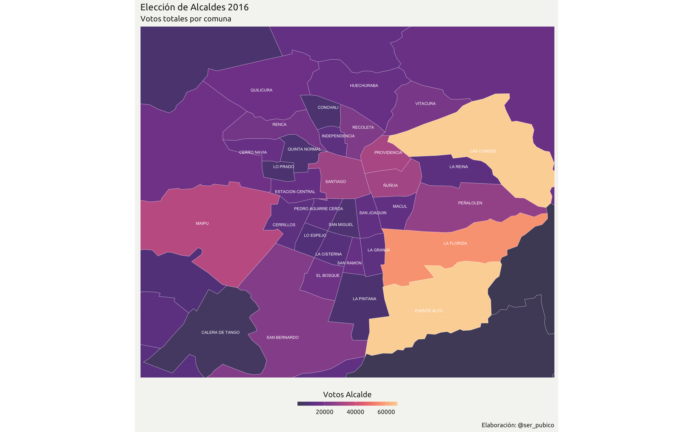
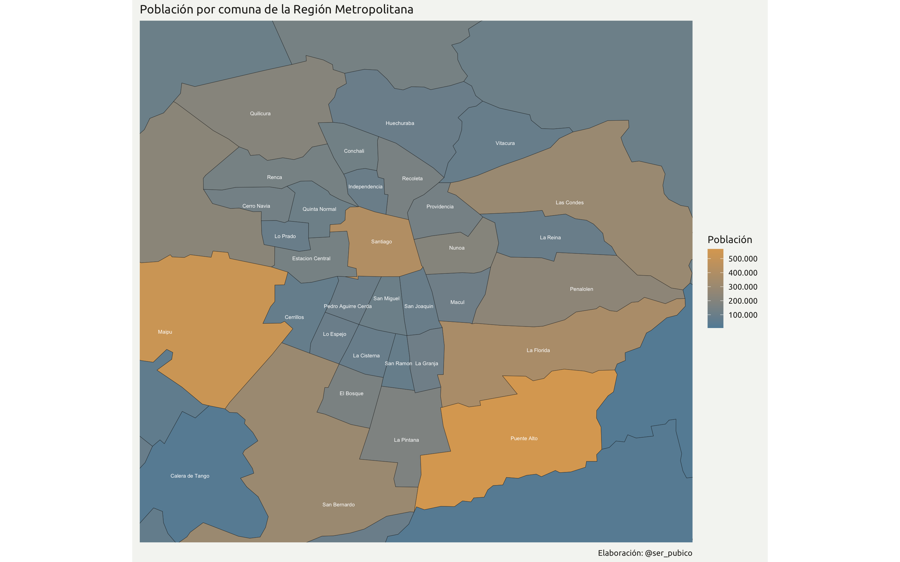

# Visualizaciones
## Elección Municipal 2016
El siguiente mapa refleja los votos obtenidos por los Alcaldes electos de las comunas de la Región Metropolitana (RM), destancando tres de ellos, **Joaquin Lavin, German Codina y Rodolfo Carter**.

## Graficos sociodemograficos 
El siguiente mapa, describe la cantidad de población por comuna según el Censo 2017. Las comunas más pobladas de la RM son **Puente, Maipu y Santiago**.

